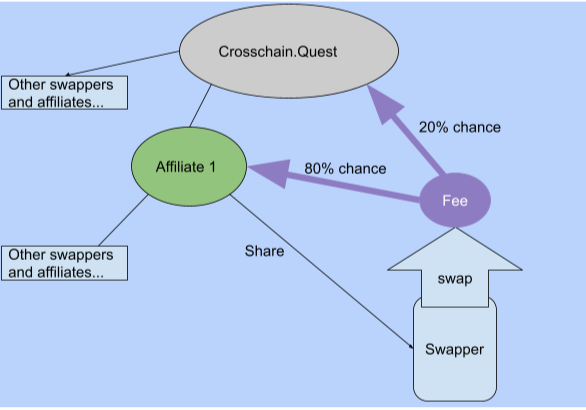
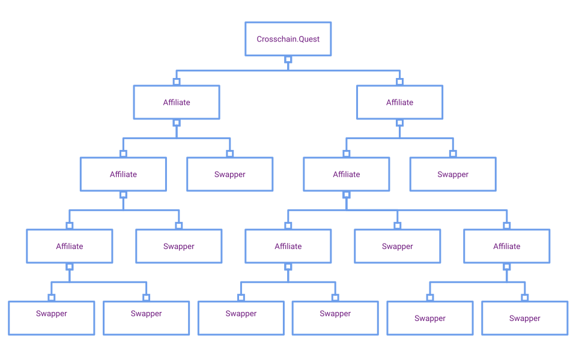
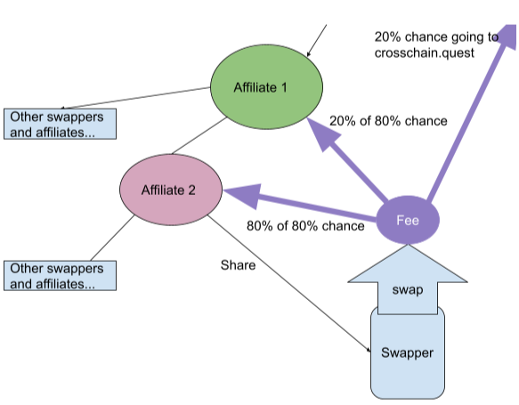

### Ever want to run your own exchange?
#### Now you can earn up to 80% of the fees charged at Crosschain.Quest by sharing an affiliate link. Crosschain.Quest is a fully client-side app so here’s how it works:

### 1. You create and share your affiliate link.

- To create an affiliate link you will need a Thorchain address. This affiliate link will be cached in  the user’s browser.

### 2. A user makes a swap

- Once a user makes a swap, a random number is generated by the client. This random number is used to decide which affiliate will get the swap.

    * There is a 20% chance that crosschain.quest will receive the swap fee.   

    * There is an 80% chance that the affiliate(s) will earn the swap fee.   

- Over time, due to the [law of large numbers](https://en.wikipedia.org/wiki/Law_of_large_numbers), the fees earned will tend towards a predictable percentage over a large number of swaps.

### 3. The Thorchain network converts the fee to $RUNE and sends it to your address. (no trust required)

In order to send Rune to your address, the fees must first be converted by the network. If the amount of money swapped is too small, it will be swallowed by the network because it will be unable to pay for the conversion.

# Crypto Karma: Recruiting other affiliates

 In addition to swap fees, you can earn a percentage of fees after signing up additional affiliates. A user will sign up on the affiliate page and the application will recognize that they are themselves an affiliate. When the new affiliate shares their link, any fees earned from a swap will follow the 20/80 split, but now the new affiliate will have an 80% chance of earning the old affiliates swap fee.

 
&nbsp;
  

 ## Is this a pyramid scheme?

 No, a pyramid scheme is a scam where members recruit newer members to pay upfront fees. There is no upfront cost to become an affiliate. Anyone who tells you otherwise is indeed a scammer. Also, anyone can become a top tier affiliate for free. The affiliates at the lower tier have a very high chance of earning swap fees.
&nbsp;
  

## How do I make sure I’m a top tier affiliate?

Crosschain.Quest is purely client-side. All affiliate information is stored in your browser, so you can clear any affiliate information by clearing your cache. With that said, please consider keeping the affiliate information to pay gratitude to the affiliate who brought you to this site.

&nbsp;
 

&nbsp;

CROSSCHAIN.QUEST reserves the right to amend or withdraw this article and/or the terms of our Affiliate Program at any time and for any reason, without prior notice.

CROSSCHAIN.QUEST may adjust the proportion of referrals at any point and reserves the right to adjust the rules of the referral program.
