## Click the Continue button to Open the App 

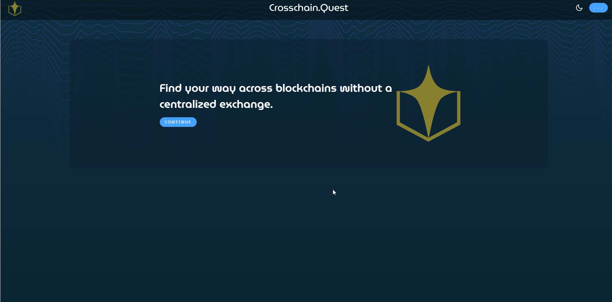

## Connect Wallet

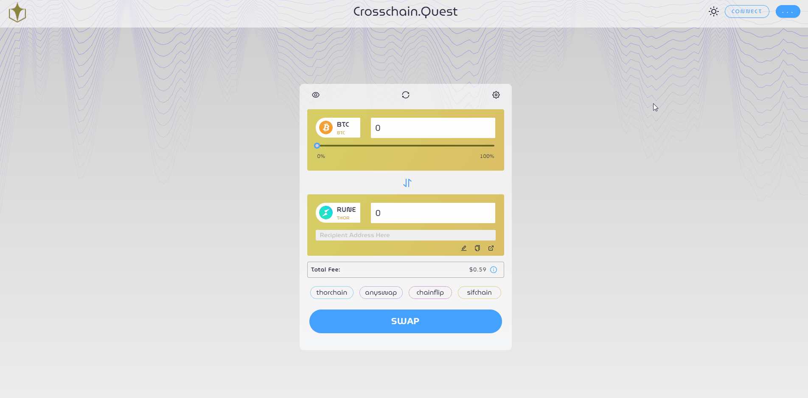

## No Wallet
### -Select “CREATE KEYSTORE”
### -Enter NEW PASSWORD
### -Click “CREATE”

#### (DO NOT AUTO SAVE PASSWORD in Browser)

## Choose between Daytime and Nighttime Background

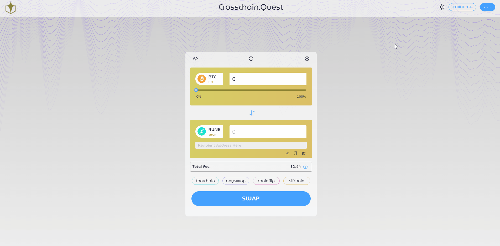

## Settings

### Slippage tolerance Set to Desired % (3% 5% 10%)

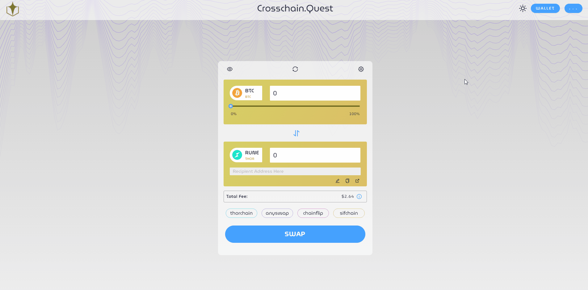

## Transaction Fee Preferences (Average, Fast, Fastest)

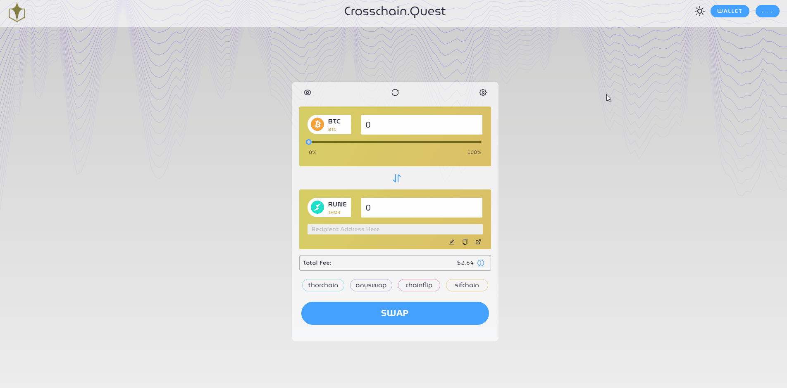

## Refresh button

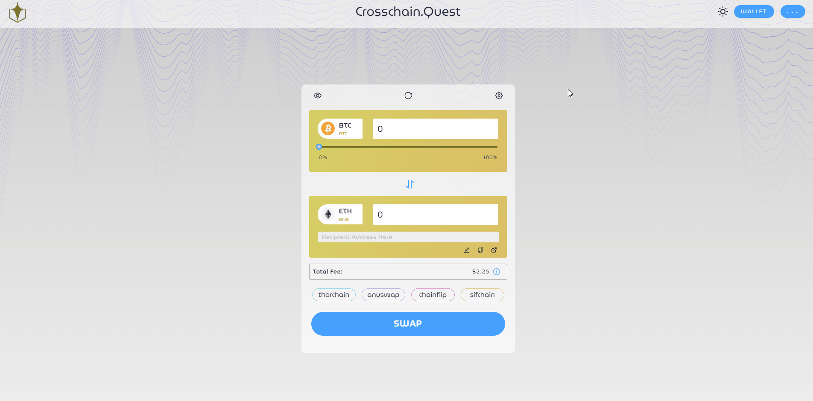

## Refresh page button

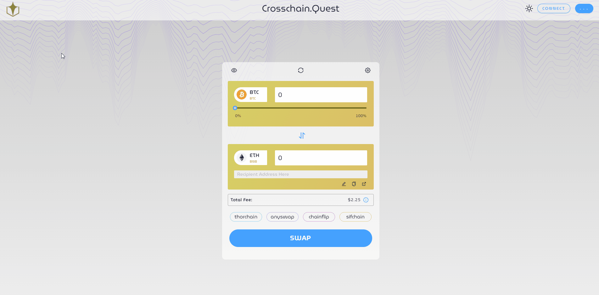

## Edit Button 
### (to manually enter destination address)

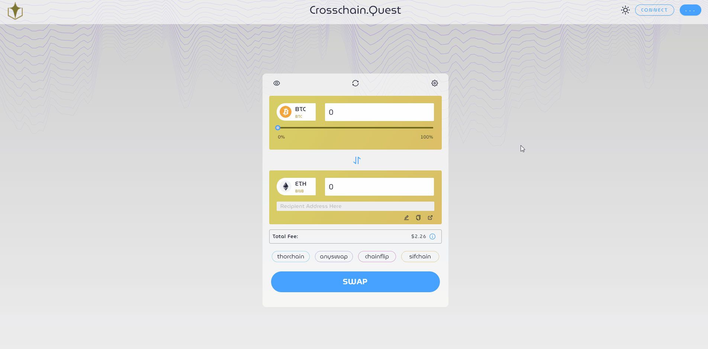

## Copy Button 
### (copies address entered)

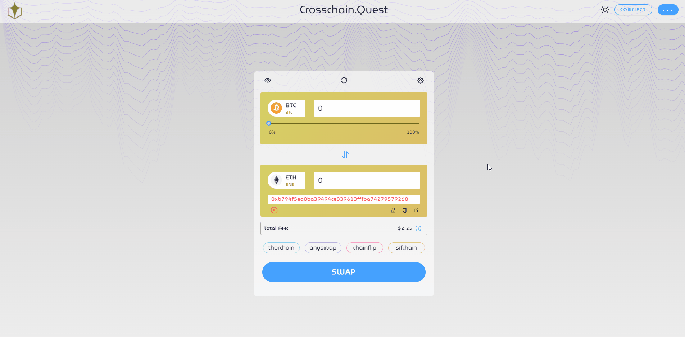

## Go to Account Button

### This button opens destination address in explorer

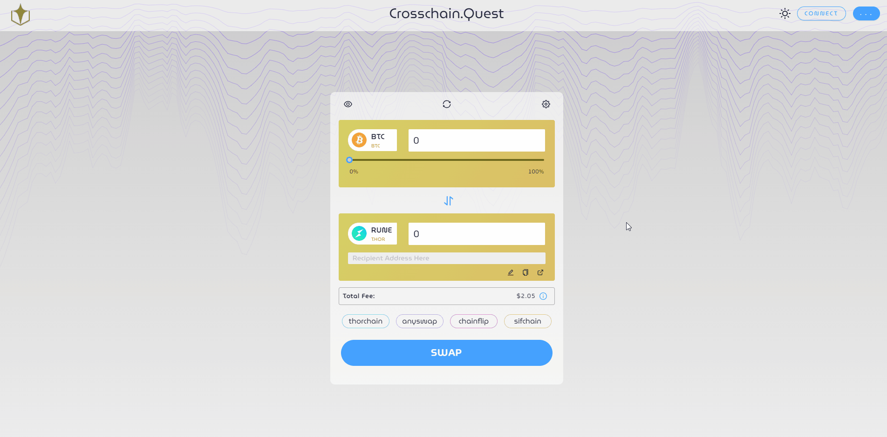

## Select an Asset to Swap
### Manually enter desired token amount to swap
###                  Or
### Use the slider from left to right
#### To get MAX amount slide all the way to the Right
##### ALWAYS verify the address the Token is being sent to is correct

## Total Fee (sum of Network fee and transaction fee) will be here

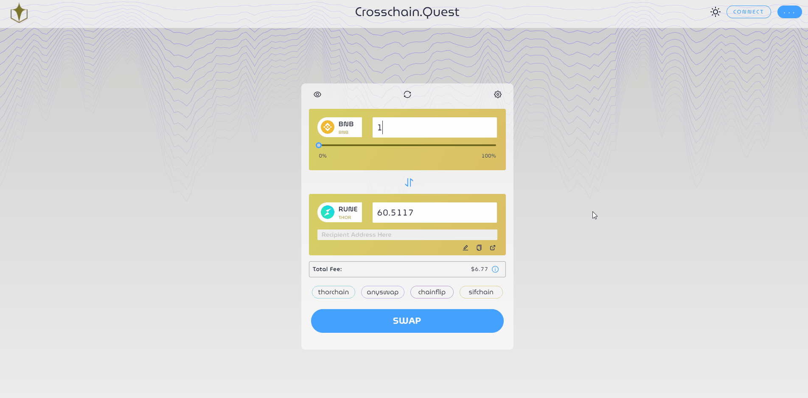

## How to view Previous Transactions

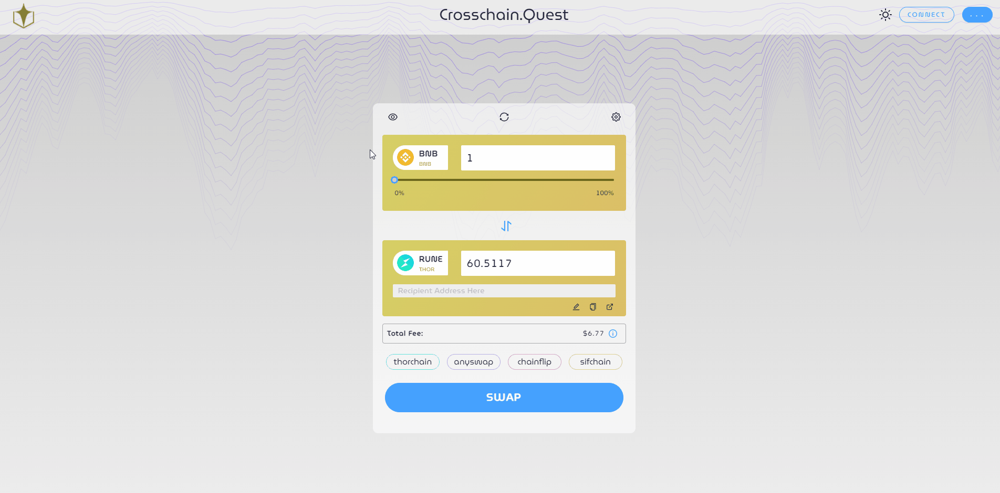

## Elipses

### About - Goes to crosschain.quest landing page

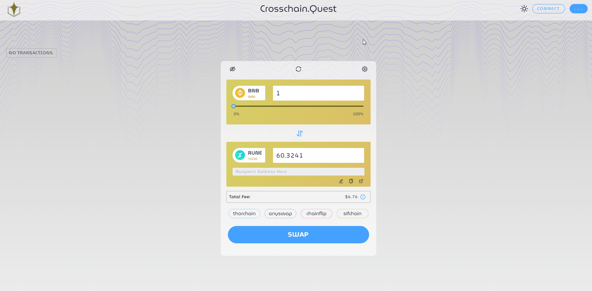

### Swap - Brings to Swap Page

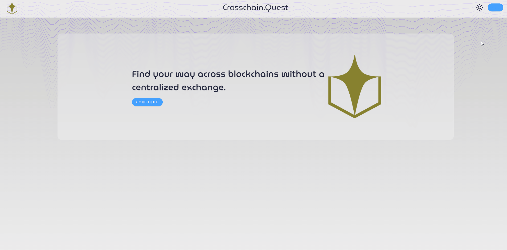

### Upgrade RUNE

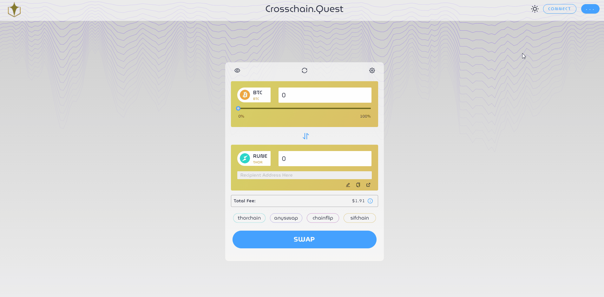

### Discord - Login with USER….or Create Account

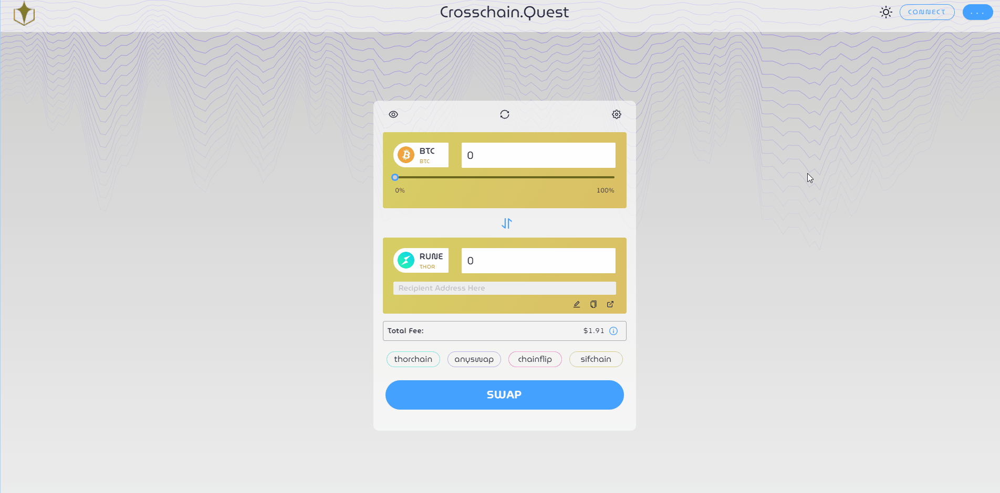

