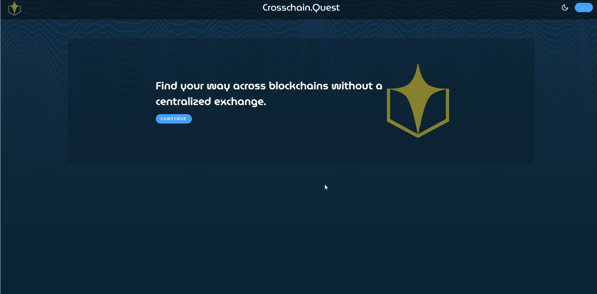
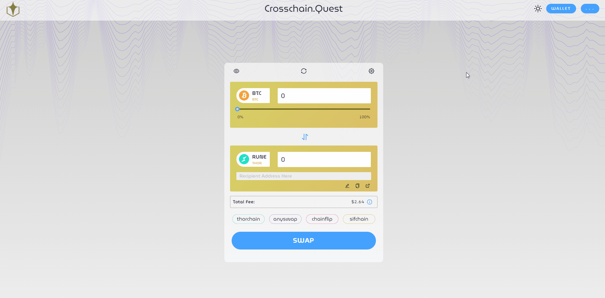
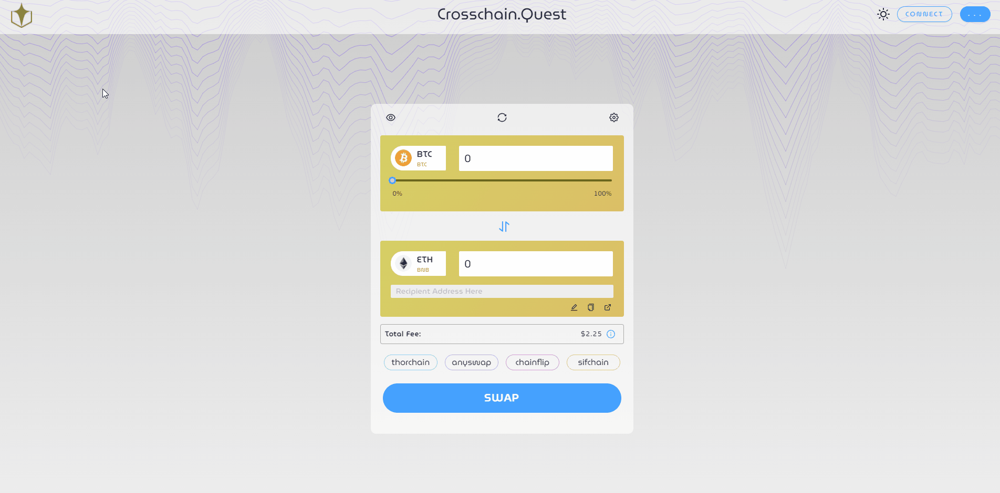
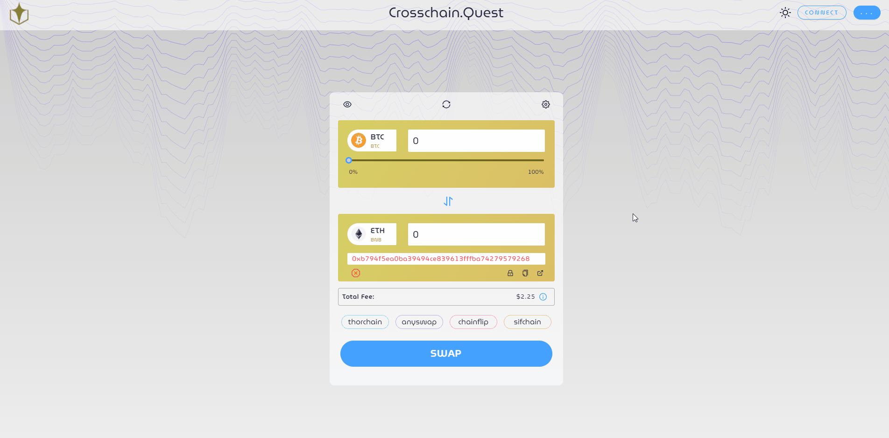

## Click the Continue button to Open the App 

## Connect Wallet

## No Wallet
### -Select “CREATE KEYSTORE”
### -Enter NEW PASSWORD
### -Click “CREATE”

#### (DO NOT AUTO SAVE PASSWORD in Browser)

## Choose between Daytime and Nighttime Background

# Settings

## Slippage tolerance Set to Desired % (3% 5% 10%)

## Transaction Fee Preferences (Average, Fast, Fastest)

## Refresh button

## Refresh page button

## Edit Button 
### (to manually enter destination address)

## Copy Button 
### (copies address entered)

